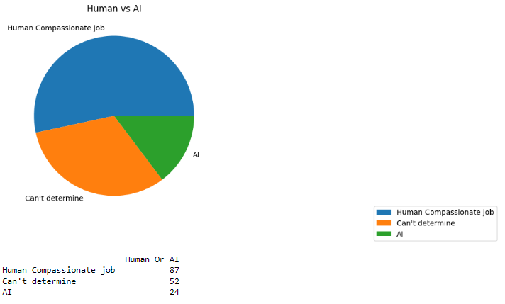
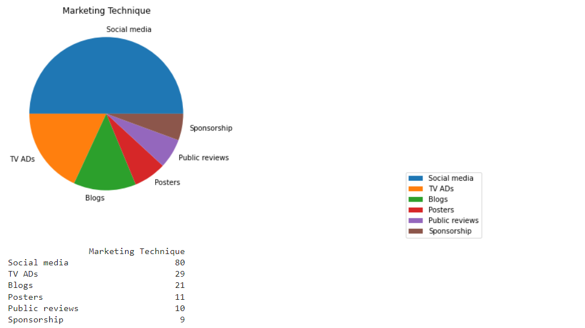

# Data-Analysis

Comparing Direct and Indirect Marketing Strategies and Predicting AI Impact on Jobs

This project is a data analysis project that uses Python to compare the effectiveness of direct and indirect marketing strategies and to predict the impact of AI on jobs in the next five years. It uses various statistical methods, such as descriptive statistics, hypothesis testing, and regression analysis, to explore and answer the research questions.

<center>
    
</center>

<center>
    
</center>

## Tech-Stack

- Python

## Data Sources and Research Questions

The data for this project comes from two sources:

- A survey of 150 customers who were exposed to either direct or indirect marketing campaigns for a new product.
- A survey of 150 workers who were asked about their opinions on AI taking over their jobs in the next five years.
  
## Installation and Usage

To install and run this project, you need to have Python 3 installed on your computer. You also need to install and import the following Python libraries:

- pandas
- numpy
- scipy
- statsmodels
- matplotlib
- seaborn

To download the code and data files for this project, you can clone this GitHub repository using the following command:

```
git clone https://github.com/Amritha-07/Data-Analysis.git
```

## Results and Findings

The results and findings of the data analysis are summarized below:

#### Direct Advertising VS Indirect Advertising

- The conclusion of the hypothesis testing was that indirect marketing had a higher purchase intention than direct marketing, which supports the claim that indirect marketing is better than direct marketing.

#### Impact of Artificial Intelligence on Jobs

- The AI analysis found that AI was likely to replace human workers in some occupations and sectors more than others in the next five years, based on descriptive statistics, hypothesis testing, and regression analysis.


